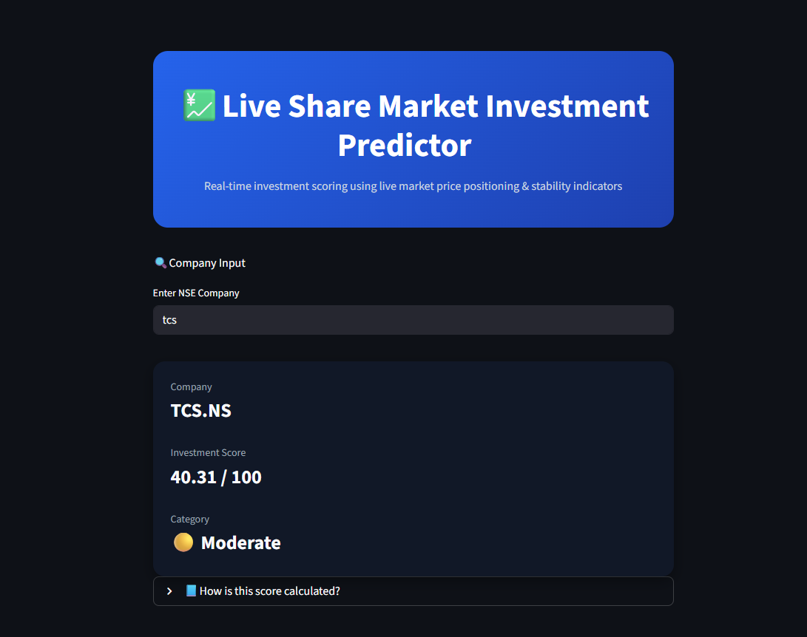

# Share Market Company Prediction — Live Investment Scoring Tool

A Streamlit web app that scores publicly listed companies on a 0–100 investment scale using live market data — helping investors quickly gauge a stock's current position and stability at a glance.

> **Note on naming:** despite "Prediction" in the repo name, this tool does **not** use a machine learning model. It's a transparent, rule-based scoring system built on live financial data. No black-box predictions — every score can be traced back to a simple, explainable formula. (Repo rename to reflect this may follow — see Future Work.)

## Demo



Enter a ticker (e.g. `tcs`), get an instant score with category rating — and an expandable "How is this score calculated?" section built right into the UI, so the logic is never hidden from the user.

## What it does

Enter any stock ticker, and the app:
1. Fetches live market data (current price, 52-week high/low, market cap) via Yahoo Finance
2. Computes an investment score using a weighted formula
3. Displays the score with a Strong / Moderate / Weak rating

## The Scoring Logic

```
price_position = (price - 52wk_low) / (52wk_high - 52wk_low) × 100
stability_score = min(100, log10(market_cap) × 10)

investment_score = 0.6 × price_position + 0.4 × stability_score
```

**Why this formula:**
- **Price position (60% weight)** — shows where the stock currently sits within its own yearly range. A stock near its 52-week low may be undervalued (or falling for a reason); near its high may signal strength (or be overbought.)
- **Stability score (40% weight)** — larger market cap generally means a more established, less volatile company. Log scale is used because market cap spans many orders of magnitude (a $10M company vs a $1T company), so raw values would swamp the score.

This is a fundamentals-based heuristic, not a statistical or ML prediction — it doesn't forecast future price movement, it summarizes current standing.

## Tech Stack

- Python
- Streamlit (UI)
- yfinance (live market data)

## Project Structure

```
Share-Market-Company-Prediction/
│
├── app.py                      # Streamlit UI
├── src/
│   ├── live_data_fetch.py      # Pulls live data via yfinance
│   └── model.py                # Investment score calculation
├── requirements.txt
└── README.md
```

## Setup

**1. Clone the repository**
```bash
git clone https://github.com/khushi1215/Share-Market-Company-Prediction.git
cd Share-Market-Company-Prediction
```

**2. Create a virtual environment**
```bash
python -m venv venv
venv\Scripts\activate      # Windows
source venv/bin/activate   # Linux/macOS
```

**3. Install dependencies**
```bash
pip install -r requirements.txt
```

**4. Run the app**
```bash
streamlit run app.py
```
App opens at `http://localhost:8501`

## How to Use

1. Enter a stock ticker (e.g. `AAPL`, `TCS.NS`, `RELIANCE.NS`)
2. View the computed investment score and rating
3. Try different tickers to compare companies

## Limitations & Future Work

- **Two-factor model is simplistic** — real fundamental analysis considers P/E ratio, debt-to-equity, earnings growth, sector context, and more. Current formula is intentionally simple and explainable, not comprehensive.
- **No historical backtesting** — the score reflects a company's *current* snapshot; it hasn't been validated against how well high-scoring companies actually performed afterward. Backtesting this against historical returns is a natural next step to prove (or disprove) the formula's usefulness.
- **No ML model (by design, for now)** — a genuine next iteration would add a trained model (e.g. regression on historical fundamentals → forward returns) to compare against this heuristic baseline.
- **Single-ticker lookup only** — no comparison view, watchlist, or portfolio-level scoring yet.
- **Repo naming** — "Prediction" is misleading for a scoring tool; considering a rename to something like `Live-Investment-Scorer` for accuracy.

## Disclaimer

This tool is for educational purposes only and does not constitute financial advice. Investment scores are based on a simplified heuristic and should not be the sole basis for any investment decision.
